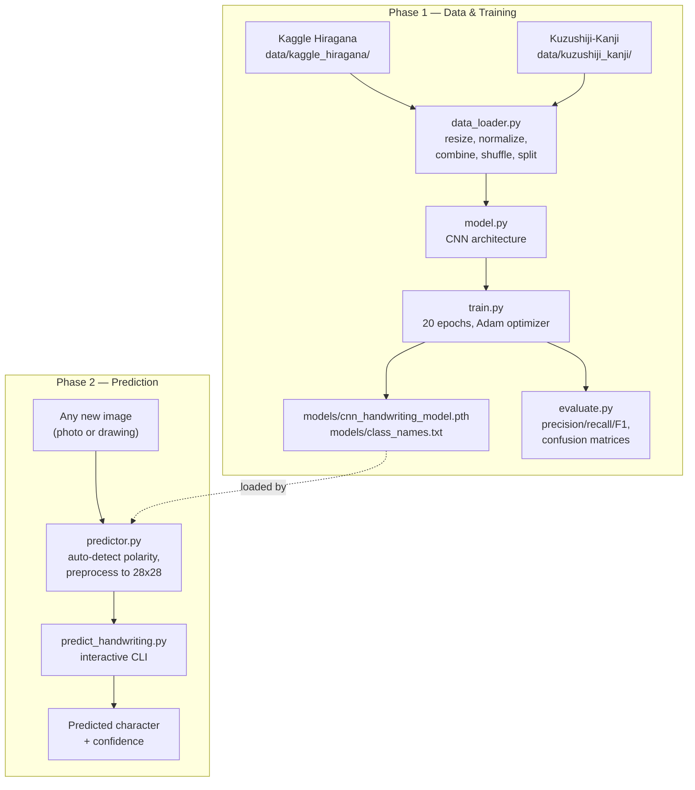
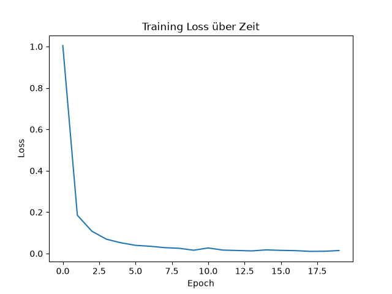
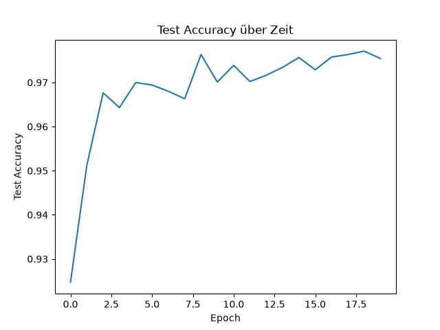
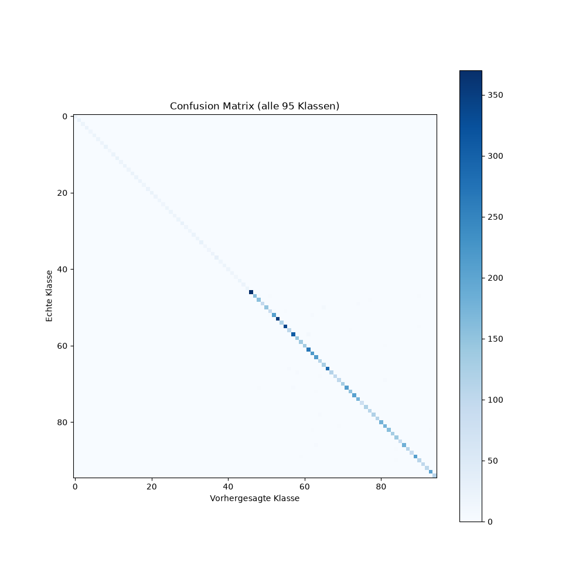
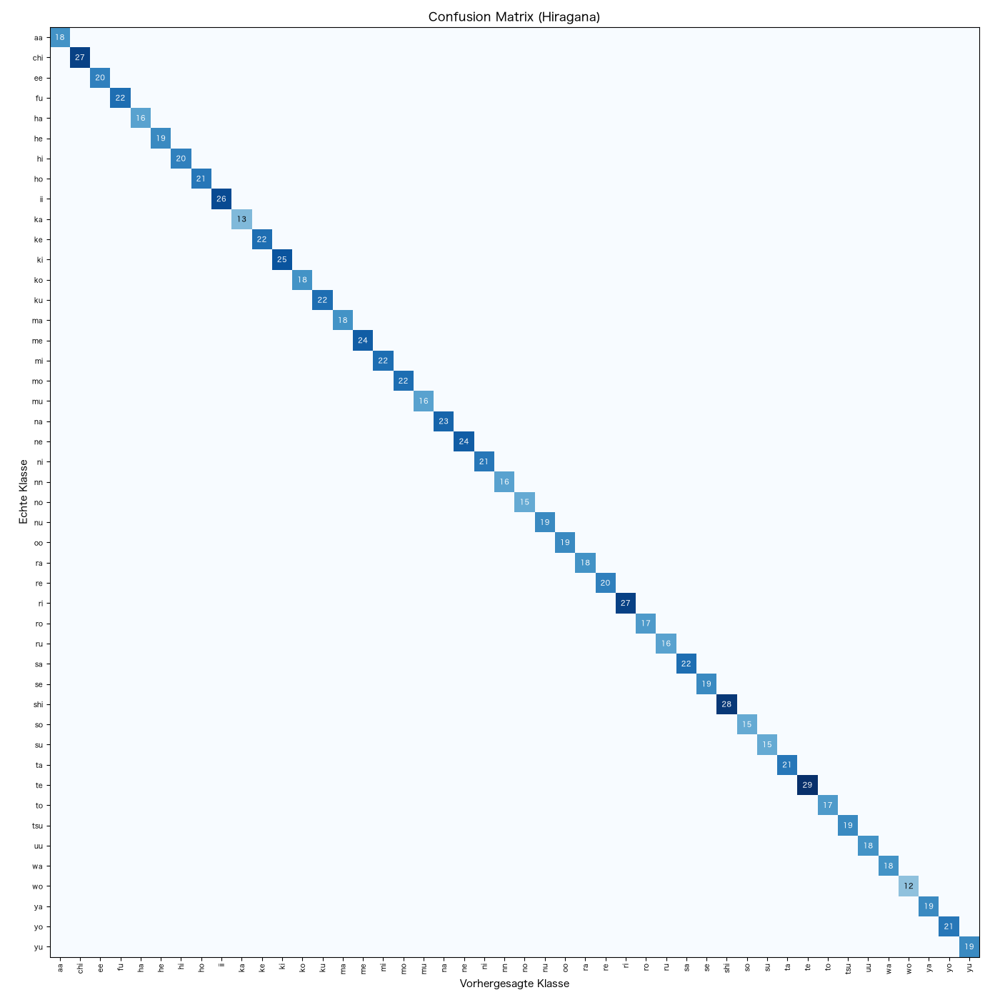
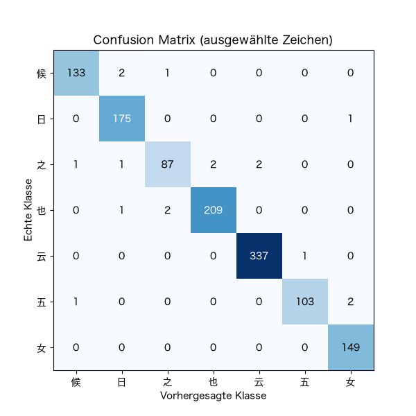
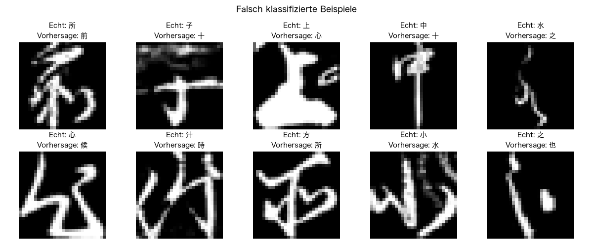
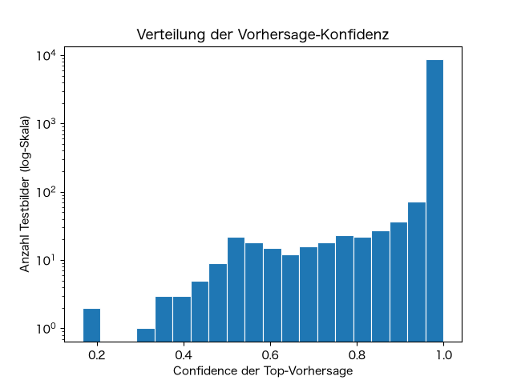
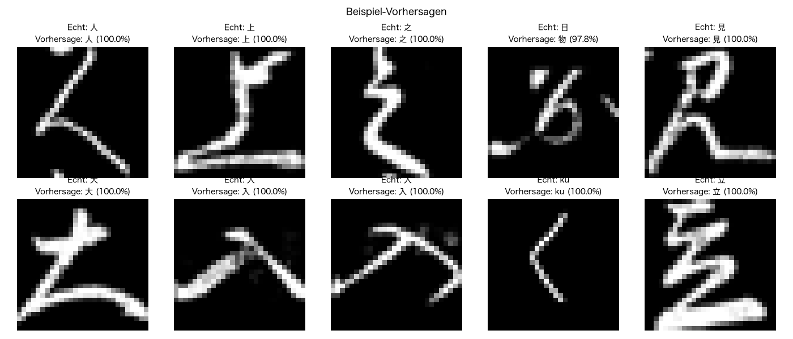

# Japanese Handwriting Recognition

A convolutional neural network (CNN), built in PyTorch, that recognizes handwritten Japanese characters: 46 hiragana and 49 kanji, 95 classes in total. The kanji half is drawn from real historical *Kuzushiji* cursive script, which often looks quite different from modern printed kanji, making this a genuinely harder recognition task than standard printed-character OCR.

## How it works

The project is split into two phases:

**Phase 1 — Data & Training** (`src/data_loader.py` → `src/model.py` → `src/train.py`)
Two datasets with opposite pixel conventions (Kaggle hiragana photos vs. Kuzushiji-Kanji scans) are loaded, resized to 28x28, normalized to a shared convention, combined into one 95-class dataset, and split 80/20 into train/test. A 3-layer CNN is trained on the training set for 20 epochs; whichever epoch scores best on the test set is saved.

**Phase 2 — Prediction** (`src/predictor.py` → `predict_handwriting.py`)
Given the path to any image, the system detects its color polarity automatically, preprocesses it into the same 28x28 format the model was trained on, and returns the predicted character with a confidence score.



## Project structure

```
Japanese Handwriting Recognition/
├── data/                              (downloaded datasets — not committed, see Setup)
│   ├── kaggle_hiragana/                   46 folders, one per hiragana character
│   └── kuzushiji_kanji/kkanji2/            49 folders, one per kanji character
├── models/
│   ├── cnn_handwriting_model.pth       (generated by train.py — not committed)
│   └── class_names.txt                 (generated by train.py — label index -> character)
├── notebooks/
│   ├── 01_exploration.ipynb           (data exploration)
│   ├── 02_model_inspection.ipynb      (trained filters & feature maps, visualized)
│   └── 03_project_journey.ipynb       (key findings, bugs, and decisions during development)
├── results/                            (generated by train.py / evaluate.py / predictor.py)
├── src/
│   ├── data_loader.py                  (load, combine, normalize both datasets)
│   ├── model.py                        (CNN architecture)
│   ├── train.py                        (training loop)
│   ├── evaluate.py                     (precision/recall/F1, confusion matrices, error analysis)
│   └── predictor.py                    (load model, preprocess an image, predict)
├── predict_handwriting.py              (main entry point — interactive CLI demo)
└── requirements.txt
```

## Setup

1. **Clone the repo and set up a virtual environment:**
   ```bash
   git clone <this-repo-url>
   cd "Japanese Handwriting Recognition"
   python3 -m venv venv
   source venv/bin/activate
   pip install -r requirements.txt
   ```
   `requirements.txt` intentionally leaves most package versions unpinned (only `jupyter==1.0.0` is pinned). This was built on Python 3.14, new enough that specific older pinned versions (e.g. `torch==2.0.0`) have no prebuilt wheels for it. Leaving versions open lets `pip` resolve whatever's actually compatible with your Python. Versions confirmed working during development: torch 2.14.0, torchvision 0.29.0, numpy 2.5.3, pandas 3.0.5, matplotlib 3.11.2, scikit-learn 1.9.1, pillow 12.3.0.

2. **Get the two datasets** (not committed to this repo — large, and fully reproducible from source):

   - **Hiragana:** download [Handwritten Japanese Hiragana Characters](https://www.kaggle.com/datasets/farukece/handwritten-japanese-hiragana-characters) from Kaggle and extract it so you end up with `data/kaggle_hiragana/<character>/<image>.jpg` (46 character folders, ~100 images each).
   - **Kanji:** download the Kuzushiji-Kanji dataset from the [Kuzushiji dataset repo](https://github.com/rois-codh/kmnist):
     ```bash
     curl -L -o kkanji.tar https://codh.rois.ac.jp/kmnist/dataset/kkanji/kkanji.tar
     tar -xf kkanji.tar
     ```
     This extracts to a folder `kkanji2/` with all 3,832 kanji classes. Move (or symlink) it to `data/kuzushiji_kanji/kkanji2/`. The full dataset is extremely imbalanced (most classes have only a handful of images), so this project prunes it down to the 49 best-represented classes:
     ```python
     import os, shutil
     root = "data/kuzushiji_kanji/kkanji2"
     counts = {d: len(os.listdir(os.path.join(root, d))) for d in os.listdir(root)}
     top49 = set(sorted(counts, key=lambda k: -counts[k])[:49])
     for d in list(counts):
         if d not in top49:
             shutil.rmtree(os.path.join(root, d))
     ```

3. **Train the model** (generates the checkpoint — not committed, since it's fully reproducible):
   ```bash
   python3 src/train.py
   ```

## Usage

**Train the model:**
```bash
python3 src/train.py
```
Loads and combines both datasets, trains for 20 epochs, saves the best-performing checkpoint to `models/cnn_handwriting_model.pth`, writes `models/class_names.txt`, and saves `results/training_loss.png` + `results/accuracy_plot.png`.

**Evaluate the trained model:**
```bash
python3 src/evaluate.py
```
Prints a per-class precision/recall/F1 report and saves confusion matrices plus a misclassified-examples grid to `results/`.

**Predict on your own image:**
```bash
python3 predict_handwriting.py
```
Prompts for an image path, then prints the predicted character and confidence:
```
========================================
HANDWRITING PREDICTION
========================================
Bild: data/kuzushiji_kanji/kkanji2/U+5B50/000d9fdb20ab39fc.png
Vorhergesagtes Zeichen: 子 (U+5B50)
Konfidenz: 100.00%
========================================
```
Works with either a light-background/dark-ink photo or a dark-background/light-stroke image. `predictor.py` detects the polarity automatically from the image's mean brightness, rather than assuming one fixed convention.

## Model performance

**97.71% test accuracy** on 8,995 held-out images never seen during training.

| Metric | Hiragana (46 classes) | Kanji (49 classes) | Overall |
|---|---|---|---|
| Precision | 1.00 | 0.91 – 1.00 | 0.98 (macro: 0.99) |
| Recall | 1.00 | 0.91 – 1.00 | 0.98 (macro: 0.99) |
| F1-score | 1.00 | 0.92 – 1.00 | 0.98 (macro: 0.99) |

The perfect hiragana score isn't a bug: that source dataset has much lower visual variation between samples of the same character than the real historical Kuzushiji cursive handwriting used for kanji, making the 46-way hiragana task genuinely easier. See [`notebooks/03_project_journey.ipynb`](notebooks/03_project_journey.ipynb) for the investigation that ruled out data leakage as the cause.

**Why look at per-class metrics instead of just overall accuracy?** With 95 classes drawn from two datasets of very different difficulty, a single accuracy number hides exactly this kind of asymmetry. Breaking it down by class (via `classification_report`) is what actually revealed the hiragana/kanji difficulty gap above. A single aggregate score would have looked like an unqualified success and hidden a real thing worth understanding about the data.

### Training curves

| Training Loss | Test Accuracy |
|---|---|
|  |  |

Accuracy jumps to ~95% within the first two epochs, then plateaus around 97% from epoch 6 onward while the training loss keeps dropping toward zero. A mild overfitting signal, though not a concerning one given the final test performance.

### Confusion matrices

| All 95 classes | Hiragana only (46 classes) |
|---|---|
|  |  |

The full matrix's near-perfect diagonal confirms there's no systematic confusion pair dominating the errors. The hiragana-only matrix (with correct-count labels, zero cells hidden) shows a completely clean diagonal. Every single hiragana test image was classified correctly.

**A closer look at the weakest kanji classes** and what they get mistaken for most often:



### Error analysis



Many of the model's actual mistakes are on genuinely ambiguous input. Several of these misclassified samples are hard to read even for a human unfamiliar with Kuzushiji cursive script, not cases where the model missed something obvious.

### Confidence distribution



For each of the 8,995 test images, this is the model's own confidence (softmax probability) in its top prediction. The y-axis uses a log scale since on a linear scale, the images near 100% confidence would completely dwarf everything else, hiding the small tail of harder cases entirely. That tail is the point: a handful of images get confidence as low as ~20-40%, and those are almost certainly the same ambiguous cases shown above, not random noise.

The last bin alone (confidence near 100%) contains 8,690 of the 8,995 images, over 96% of all test images fall into this single highest-confidence tier.

### Sample predictions



Ten random images pulled from the held-out test set (not the raw data folders — see [`notebooks/03_project_journey.ipynb`](notebooks/03_project_journey.ipynb) for why that distinction matters), run through the actual prediction pipeline.

## Known limitations

- **Only 49 of 3,832 possible Kuzushiji-Kanji characters are supported:** Most classes in the source dataset have too few images to train on — the median class has only 6 images, and 815 classes have exactly 1.
- **The train/test split is not stratified per class:** `prepare_data()` splits the whole shuffled dataset 80/20, so individual classes end up with slightly different test-set sizes by chance (e.g. hiragana classes range from 12 to 29 test images, expected value 20) — the overall ratio is correct, the per-class ratio isn't guaranteed.
- **Hiragana accuracy isn't directly comparable to kanji accuracy:** the perfect hiragana scores reflect a low-variance source dataset, not necessarily how well the model generalizes to more diverse real-world hiragana handwriting.
- **The automatic polarity detection assumes the background covers most of the image**, which holds for any normal single-character image but could misfire on an unusual input where ink covers more than half the frame.
- **Model weight initialization isn't seeded** (only the data shuffle is), so retraining from scratch reproduces similar overall accuracy but genuinely different learned filters each time.

See [`notebooks/03_project_journey.ipynb`](notebooks/03_project_journey.ipynb) for the full story behind these findings, including two data-leakage bugs (a missing random seed, and a demo script accidentally sampling from training data) that were found and fixed during development.

## Notebooks

- [`01_exploration.ipynb`](notebooks/01_exploration.ipynb) — loading the hiragana data, inspecting individual images and their raw pixel values.
- [`02_model_inspection.ipynb`](notebooks/02_model_inspection.ipynb) — comparing trained vs. random filters, visualizing all 32 first-layer filters, and seeing exactly which parts of a real character each filter responds to.
- [`03_project_journey.ipynb`](notebooks/03_project_journey.ipynb) — a retrospective walkthrough of the key discoveries, bugs, and decisions behind the code in `src/`, with real, re-executable code for each finding.

## Tech stack

- **Deep learning:** PyTorch
- **Data & metrics:** NumPy, Pandas, scikit-learn, Pillow
- **Visualization:** Matplotlib
- **Exploration:** Jupyter
